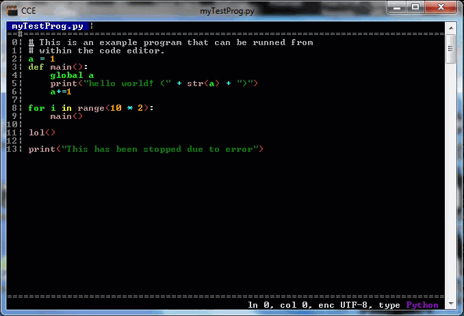

    
     
    
    

        Lightweight, elegant and feature packed text editor in your console! 
        A good alternative to vim or nano. 
        <em>Made with ❤️ by <a href="https://twitter.com/williamragstad">William</a></em>
    

 

 

Take me to the [installation](#installation) :arrow_right:

## Preview

    
    

        <em>(This displays an older version of CCE)</em>
    

    

        
        

            Open any file with CCE!
        

    

    

        
        

            Drag and drop multiple files to open them as tabs in CCE!
        

    

    

        
        

            Execute your code directly inside the editor!
        

    

## Usage

The editor has many features including real-time syntax highlighting and keyboard shortcuts.
Here is a list of all keyboard shortcuts.

| Keystrokes                                                   | Description                                        |
| ------------------------------------------------------------ | -------------------------------------------------- |
| <kbd>:arrow_left:</kbd><kbd>:arrow_up:</kbd><kbd>:arrow_down:</kbd><kbd>:arrow_right:</kbd> | Move around in the document                        |
| <kbd>CTRL</kbd>+<kbd>:arrow_left:</kbd>                      | Move to the leftmost position on the current line  |
| <kbd>CTRL</kbd>+<kbd>:arrow_right:</kbd>                     | Move to the rightmost position on the current line |
| <kbd>ALT</kbd>+<kbd>0</kbd>,<kbd>1</kbd>,<kbd>2</kbd>,... or <kbd>9</kbd> | Switch between open tabs                           |
| <kbd>CTRL</kbd>+<kbd>N</kbd>                                 | New untitled file                                  |
| <kbd>CTRL</kbd>+<kbd>O</kbd>                                 | Open new file                                      |
| <kbd>CTRL</kbd>+<kbd>S</kbd>                                 | Save current file                                  |
| <kbd>CTRL</kbd>+<kbd>C</kbd>                                 | Copy to clipboard                                  |
| <kbd>CTRL</kbd>+<kbd>X</kbd>                                 | Cut to clipboard                                   |
| <kbd>CTRL</kbd>+<kbd>V</kbd>                                 | Paste from clipboard                               |
| <kbd>CTRL</kbd>+<kbd>Z</kbd>                                 | Undo                                               |
| <kbd>CTRL</kbd>+<kbd>Y</kbd>                                 | Redo                                               |
| <kbd>CTRL</kbd>+<kbd>R</kbd>                                 | **Run** executable file types                      |
| <kbd>ESC</kbd>                                               | Close the program **if all files are saved**       |

## Installation

Download the latest version of CCE below.

| Win x32            | Win x64            | Mac                | Linux              |
| ------------------ | ------------------ | ------------------ | ------------------ |
| [Download Alpha]() | [Download Alpha]() | [Download Alpha]() | [Download Alpha]() |

~~Or install a previous version from [here]().~~

## Future

I have big ambitions for this project, and feel like if it gets enough attention, it would be worth implementing the following functionalities:

* Plug-ins/*Extensions* support 🔌
* Custom color themes support 🌈
* Custom skin themes support 🎨
* Text selection 📋
* Preferences/*Settings* page ⚙️
* Auto detect new versions 📥
* Add syntax highlighting for more languages!!! 🎉
* Optimize and speed up performance :bullettrain_front::dash:

**I highly appreciate** if you want to **help** me with this project!
Add your own twist or modification, or create your own distribution entirely!
